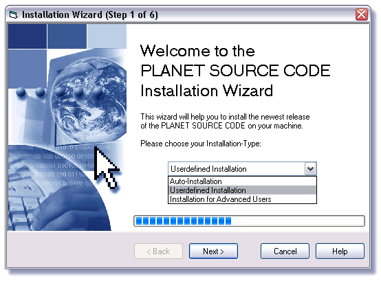



## Wizard\-Template \(XP\-Style\)

### Description

A Template for a XP-Styled Wizard like Microsoft-Products use 'em. Don't found something like this here, so i did my own one. Useable for Installations, PlugIns or (you guess it) Wizards.

Key-Features:

* Easily add as many steps as you want.

* Work with the collected data after every step, at the end of the wizard or both, what you like.

* Timer-Controled, not Button-Controled.

* Jump between Steps easily

* Includes XP-Progressbar by Aki (Just change to a CommonControl-Bar if you don't like it)

---

Known Bugs: None.

---

If you like it, please vote - If you don't like it, you probably use Linux :D
 
### More Info
 

             |
---                |---
**Submitted On**   |2002-09-23 19:33:00
**By**             |[Ninnghizidha](https://github.com/Planet-Source-Code/PSCIndex/blob/master/ByAuthor/ninnghizidha.md)
**Level**          |Intermediate
**User Rating**    |4.7 (107 globes from 23 users)
**Compatibility**  |VB 5\.0, VB 6\.0
**Category**       |[Complete Applications](https://github.com/Planet-Source-Code/PSCIndex/blob/master/ByCategory/complete-applications__1-27.md)
**World**          |[Visual Basic](https://github.com/Planet-Source-Code/PSCIndex/blob/master/ByWorld/visual-basic.md)
**Archive File**   |[Wizard\-Tem1367059262002\.zip](https://github.com/Planet-Source-Code/ninnghizidha-wizard-template-xp-style__1-39288/archive/master.zip)

